```python
import pandas as pd
import numpy as np
import seaborn as sns
import matplotlib.pyplot as plt
import scipy.stats as stats
```


```python
df = pd.read_csv("/kaggle/input/global-supply-chain-risk-and-logistics-2024-2026/global_supply_chain_risk_2026.csv")
```


```python
df.head()
```


<div>
<style scoped>
    .dataframe tbody tr th:only-of-type {
        vertical-align: middle;
    }

    .dataframe tbody tr th {
        vertical-align: top;
    }

    .dataframe thead th {
        text-align: right;
    }
</style>
<table border="1" class="dataframe">
  <thead>
    <tr style="text-align: right;">
      <th></th>
      <th>Shipment_ID</th>
      <th>Date</th>
      <th>Origin_Port</th>
      <th>Destination_Port</th>
      <th>Transport_Mode</th>
      <th>Product_Category</th>
      <th>Distance_km</th>
      <th>Weight_MT</th>
      <th>Fuel_Price_Index</th>
      <th>Geopolitical_Risk_Score</th>
      <th>Weather_Condition</th>
      <th>Carrier_Reliability_Score</th>
      <th>Lead_Time_Days</th>
      <th>Disruption_Occurred</th>
    </tr>
  </thead>
  <tbody>
    <tr>
      <th>0</th>
      <td>SC-10000</td>
      <td>2025-10-16</td>
      <td>Singapore</td>
      <td>Los Angeles</td>
      <td>Rail</td>
      <td>Textiles</td>
      <td>5930.83</td>
      <td>197.42</td>
      <td>2.43</td>
      <td>5.0</td>
      <td>Hurricane</td>
      <td>0.865</td>
      <td>41.39</td>
      <td>1</td>
    </tr>
    <tr>
      <th>1</th>
      <td>SC-10001</td>
      <td>2024-04-24</td>
      <td>Singapore</td>
      <td>Shanghai</td>
      <td>Rail</td>
      <td>Automotive</td>
      <td>14285.36</td>
      <td>237.24</td>
      <td>2.30</td>
      <td>7.5</td>
      <td>Storm</td>
      <td>0.592</td>
      <td>40.92</td>
      <td>1</td>
    </tr>
    <tr>
      <th>2</th>
      <td>SC-10002</td>
      <td>2024-01-26</td>
      <td>Rotterdam</td>
      <td>Los Angeles</td>
      <td>Rail</td>
      <td>Perishables</td>
      <td>11113.91</td>
      <td>427.42</td>
      <td>1.78</td>
      <td>5.6</td>
      <td>Rain</td>
      <td>0.673</td>
      <td>11.54</td>
      <td>0</td>
    </tr>
    <tr>
      <th>3</th>
      <td>SC-10003</td>
      <td>2024-10-08</td>
      <td>Busan</td>
      <td>Hamburg</td>
      <td>Rail</td>
      <td>Electronics</td>
      <td>9180.55</td>
      <td>170.66</td>
      <td>3.20</td>
      <td>0.8</td>
      <td>Hurricane</td>
      <td>0.832</td>
      <td>53.13</td>
      <td>1</td>
    </tr>
    <tr>
      <th>4</th>
      <td>SC-10004</td>
      <td>2024-09-07</td>
      <td>Busan</td>
      <td>Singapore</td>
      <td>Air</td>
      <td>Perishables</td>
      <td>2762.27</td>
      <td>434.96</td>
      <td>2.77</td>
      <td>1.9</td>
      <td>Fog</td>
      <td>0.741</td>
      <td>0.50</td>
      <td>1</td>
    </tr>
  </tbody>
</table>
</div>


# EDA Visualization


```python
sns.set_style('whitegrid')
df['Disruption_Occurred'].value_counts()
```


    Disruption_Occurred
    1    3063
    0    1937
    Name: count, dtype: int64


```python
sns.countplot(df['Weather_Condition'])
```


    <Axes: xlabel='count', ylabel='Weather_Condition'>


    
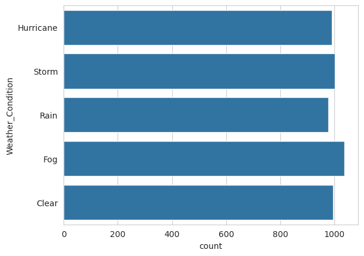
    


```python
sns.countplot(df['Origin_Port'])
```


    <Axes: xlabel='count', ylabel='Origin_Port'>


    
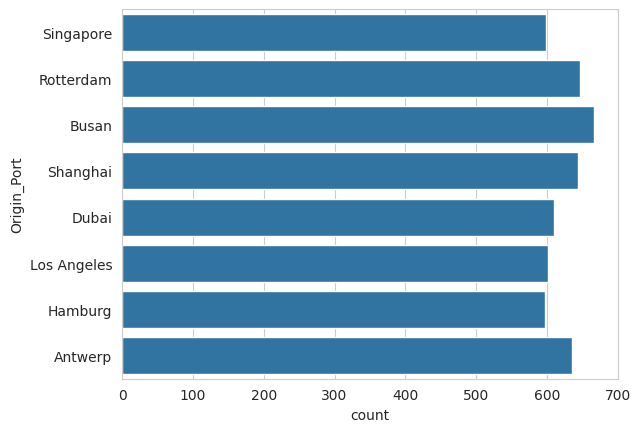
    


```python
sns.countplot(df['Destination_Port'])
```


    <Axes: xlabel='count', ylabel='Destination_Port'>


    
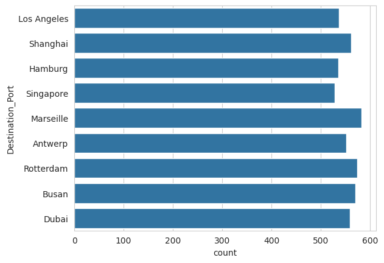
    


```python
plt.hist(df['Transport_Mode'])
```


    (array([1185.,    0.,    0., 1320.,    0.,    0., 1214.,    0.,    0.,
            1281.]),
     array([0. , 0.3, 0.6, 0.9, 1.2, 1.5, 1.8, 2.1, 2.4, 2.7, 3. ]),
     <BarContainer object of 10 artists>)


    
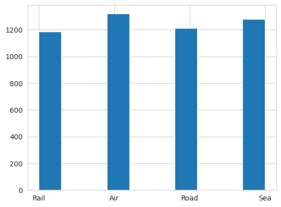
    


```python
plt.figure(figsize=(10,6))
sns.heatmap(df.corr(numeric_only=True), annot=True)
plt.show()
```


    
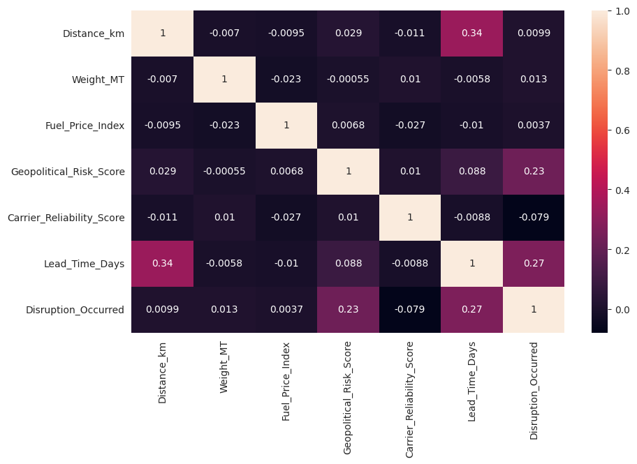
    


```python
sns.histplot(df['Product_Category'])
```


    <Axes: xlabel='Product_Category', ylabel='Count'>


    
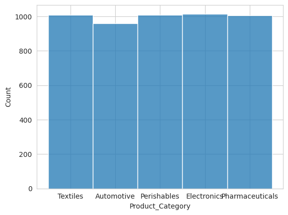
    


```python
l1 = ['Fuel_Price_Index','Geopolitical_Risk_Score','Carrier_Reliability_Score','Lead_Time_Days']

for pt in l1:
    stats.probplot(df[pt], dist="norm", plot=plt)
    plt.title(pt)
    plt.show()
```


    
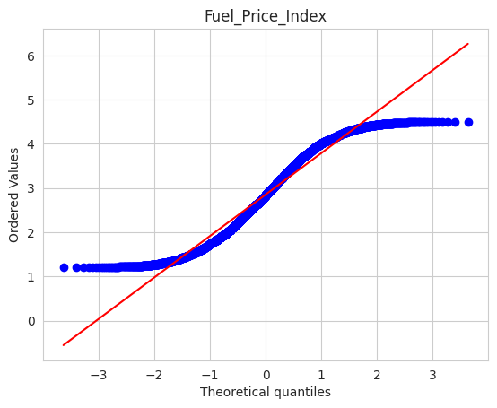
    


    
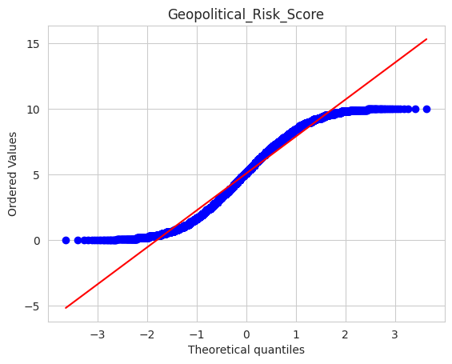
    


    
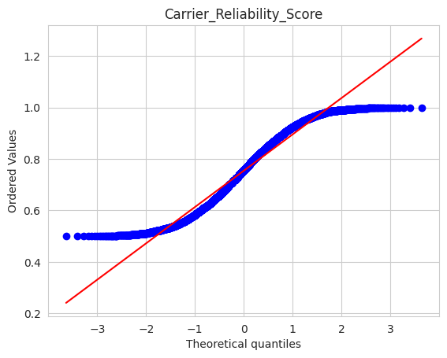
    


    
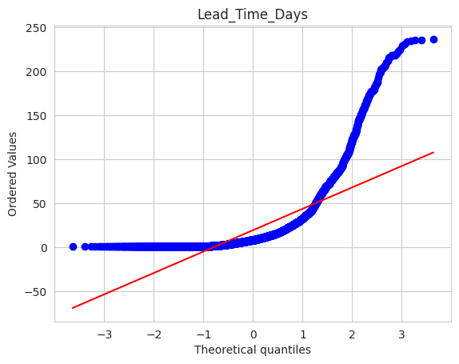
    


# Improving Data for Training


```python
from sklearn.preprocessing import PowerTransformer

pt = PowerTransformer(method='yeo-johnson')
df['Lead_Time_Days'] = pt.fit_transform(df[['Lead_Time_Days']])

stats.probplot(df['Lead_Time_Days'], dist="norm", plot=plt)
```


    ((array([-3.63568806, -3.40036853, -3.27067228, ...,  3.27067228,
              3.40036853,  3.63568806]),
      array([-1.55923488, -1.55923488, -1.55923488, ...,  2.28900439,
              2.28971217,  2.29139234])),
     (np.float64(0.9828678174271834),
      np.float64(-4.4695653624657254e-17),
      np.float64(0.9822120803395167)))


    
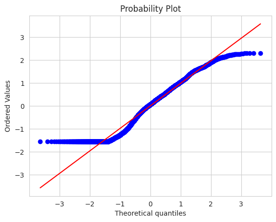
    


```python
from sklearn.preprocessing import LabelEncoder
from sklearn.preprocessing import OneHotEncoder

le = LabelEncoder()
ohe = OneHotEncoder(sparse_output = False)
```


```python
df.head()
```


<div>
<style scoped>
    .dataframe tbody tr th:only-of-type {
        vertical-align: middle;
    }

    .dataframe tbody tr th {
        vertical-align: top;
    }

    .dataframe thead th {
        text-align: right;
    }
</style>
<table border="1" class="dataframe">
  <thead>
    <tr style="text-align: right;">
      <th></th>
      <th>Shipment_ID</th>
      <th>Date</th>
      <th>Origin_Port</th>
      <th>Destination_Port</th>
      <th>Transport_Mode</th>
      <th>Product_Category</th>
      <th>Distance_km</th>
      <th>Weight_MT</th>
      <th>Fuel_Price_Index</th>
      <th>Geopolitical_Risk_Score</th>
      <th>Weather_Condition</th>
      <th>Carrier_Reliability_Score</th>
      <th>Lead_Time_Days</th>
      <th>Disruption_Occurred</th>
    </tr>
  </thead>
  <tbody>
    <tr>
      <th>0</th>
      <td>SC-10000</td>
      <td>2025-10-16</td>
      <td>Singapore</td>
      <td>Los Angeles</td>
      <td>Rail</td>
      <td>Textiles</td>
      <td>5930.83</td>
      <td>197.42</td>
      <td>2.43</td>
      <td>5.0</td>
      <td>Hurricane</td>
      <td>0.865</td>
      <td>1.202188</td>
      <td>1</td>
    </tr>
    <tr>
      <th>1</th>
      <td>SC-10001</td>
      <td>2024-04-24</td>
      <td>Singapore</td>
      <td>Shanghai</td>
      <td>Rail</td>
      <td>Automotive</td>
      <td>14285.36</td>
      <td>237.24</td>
      <td>2.30</td>
      <td>7.5</td>
      <td>Storm</td>
      <td>0.592</td>
      <td>1.194482</td>
      <td>1</td>
    </tr>
    <tr>
      <th>2</th>
      <td>SC-10002</td>
      <td>2024-01-26</td>
      <td>Rotterdam</td>
      <td>Los Angeles</td>
      <td>Rail</td>
      <td>Perishables</td>
      <td>11113.91</td>
      <td>427.42</td>
      <td>1.78</td>
      <td>5.6</td>
      <td>Rain</td>
      <td>0.673</td>
      <td>0.305092</td>
      <td>0</td>
    </tr>
    <tr>
      <th>3</th>
      <td>SC-10003</td>
      <td>2024-10-08</td>
      <td>Busan</td>
      <td>Hamburg</td>
      <td>Rail</td>
      <td>Electronics</td>
      <td>9180.55</td>
      <td>170.66</td>
      <td>3.20</td>
      <td>0.8</td>
      <td>Hurricane</td>
      <td>0.832</td>
      <td>1.368923</td>
      <td>1</td>
    </tr>
    <tr>
      <th>4</th>
      <td>SC-10004</td>
      <td>2024-09-07</td>
      <td>Busan</td>
      <td>Singapore</td>
      <td>Air</td>
      <td>Perishables</td>
      <td>2762.27</td>
      <td>434.96</td>
      <td>2.77</td>
      <td>1.9</td>
      <td>Fog</td>
      <td>0.741</td>
      <td>-1.559235</td>
      <td>1</td>
    </tr>
  </tbody>
</table>
</div>


```python
df['Weather_Condition'] = pd.DataFrame(le.fit_transform(df['Weather_Condition']))
```


```python
Transport_Mode_trans = pd.DataFrame(ohe.fit_transform(df[['Origin_Port']]),columns= ohe.get_feature_names_out(["Origin_Port"]))
Destination_Port_trans = pd.DataFrame(ohe.fit_transform(df[['Destination_Port']]),columns= ohe.get_feature_names_out(["Destination_Port"]))
Transport_Mode_trans = pd.DataFrame(ohe.fit_transform(df[['Transport_Mode']]),columns= ohe.get_feature_names_out(["Transport_Mode"]))
Product_Category_trans = pd.DataFrame(ohe.fit_transform(df[['Product_Category']]),columns= ohe.get_feature_names_out(["Product_Category"]))
```


```python
df =pd.concat([df,Transport_Mode_trans,Destination_Port_trans,Transport_Mode_trans,Product_Category_trans],axis= 1)
```


```python
df.drop(['Shipment_ID','Origin_Port','Destination_Port','Transport_Mode','Product_Category'],axis = 1 ,inplace = True)
```


```python
df.head()
```


<div>
<style scoped>
    .dataframe tbody tr th:only-of-type {
        vertical-align: middle;
    }

    .dataframe tbody tr th {
        vertical-align: top;
    }

    .dataframe thead th {
        text-align: right;
    }
</style>
<table border="1" class="dataframe">
  <thead>
    <tr style="text-align: right;">
      <th></th>
      <th>Date</th>
      <th>Distance_km</th>
      <th>Weight_MT</th>
      <th>Fuel_Price_Index</th>
      <th>Geopolitical_Risk_Score</th>
      <th>Weather_Condition</th>
      <th>Carrier_Reliability_Score</th>
      <th>Lead_Time_Days</th>
      <th>Disruption_Occurred</th>
      <th>Transport_Mode_Air</th>
      <th>...</th>
      <th>Destination_Port_Singapore</th>
      <th>Transport_Mode_Air</th>
      <th>Transport_Mode_Rail</th>
      <th>Transport_Mode_Road</th>
      <th>Transport_Mode_Sea</th>
      <th>Product_Category_Automotive</th>
      <th>Product_Category_Electronics</th>
      <th>Product_Category_Perishables</th>
      <th>Product_Category_Pharmaceuticals</th>
      <th>Product_Category_Textiles</th>
    </tr>
  </thead>
  <tbody>
    <tr>
      <th>0</th>
      <td>2025-10-16</td>
      <td>5930.83</td>
      <td>197.42</td>
      <td>2.43</td>
      <td>5.0</td>
      <td>2</td>
      <td>0.865</td>
      <td>1.202188</td>
      <td>1</td>
      <td>0.0</td>
      <td>...</td>
      <td>0.0</td>
      <td>0.0</td>
      <td>1.0</td>
      <td>0.0</td>
      <td>0.0</td>
      <td>0.0</td>
      <td>0.0</td>
      <td>0.0</td>
      <td>0.0</td>
      <td>1.0</td>
    </tr>
    <tr>
      <th>1</th>
      <td>2024-04-24</td>
      <td>14285.36</td>
      <td>237.24</td>
      <td>2.30</td>
      <td>7.5</td>
      <td>4</td>
      <td>0.592</td>
      <td>1.194482</td>
      <td>1</td>
      <td>0.0</td>
      <td>...</td>
      <td>0.0</td>
      <td>0.0</td>
      <td>1.0</td>
      <td>0.0</td>
      <td>0.0</td>
      <td>1.0</td>
      <td>0.0</td>
      <td>0.0</td>
      <td>0.0</td>
      <td>0.0</td>
    </tr>
    <tr>
      <th>2</th>
      <td>2024-01-26</td>
      <td>11113.91</td>
      <td>427.42</td>
      <td>1.78</td>
      <td>5.6</td>
      <td>3</td>
      <td>0.673</td>
      <td>0.305092</td>
      <td>0</td>
      <td>0.0</td>
      <td>...</td>
      <td>0.0</td>
      <td>0.0</td>
      <td>1.0</td>
      <td>0.0</td>
      <td>0.0</td>
      <td>0.0</td>
      <td>0.0</td>
      <td>1.0</td>
      <td>0.0</td>
      <td>0.0</td>
    </tr>
    <tr>
      <th>3</th>
      <td>2024-10-08</td>
      <td>9180.55</td>
      <td>170.66</td>
      <td>3.20</td>
      <td>0.8</td>
      <td>2</td>
      <td>0.832</td>
      <td>1.368923</td>
      <td>1</td>
      <td>0.0</td>
      <td>...</td>
      <td>0.0</td>
      <td>0.0</td>
      <td>1.0</td>
      <td>0.0</td>
      <td>0.0</td>
      <td>0.0</td>
      <td>1.0</td>
      <td>0.0</td>
      <td>0.0</td>
      <td>0.0</td>
    </tr>
    <tr>
      <th>4</th>
      <td>2024-09-07</td>
      <td>2762.27</td>
      <td>434.96</td>
      <td>2.77</td>
      <td>1.9</td>
      <td>1</td>
      <td>0.741</td>
      <td>-1.559235</td>
      <td>1</td>
      <td>1.0</td>
      <td>...</td>
      <td>1.0</td>
      <td>1.0</td>
      <td>0.0</td>
      <td>0.0</td>
      <td>0.0</td>
      <td>0.0</td>
      <td>0.0</td>
      <td>1.0</td>
      <td>0.0</td>
      <td>0.0</td>
    </tr>
  </tbody>
</table>
<p>5 rows × 31 columns</p>
</div>


# Extracting "Year" from Date


```python
df['Date'] = pd.to_datetime(df['Date'])
df['year'] = df['Date'].dt.year
df.drop(['Date'],axis = 1,inplace = True)
df['year'].value_counts()
```


    year
    2025    2545
    2024    2455
    Name: count, dtype: int64


```python
df.head()
```


<div>
<style scoped>
    .dataframe tbody tr th:only-of-type {
        vertical-align: middle;
    }

    .dataframe tbody tr th {
        vertical-align: top;
    }

    .dataframe thead th {
        text-align: right;
    }
</style>
<table border="1" class="dataframe">
  <thead>
    <tr style="text-align: right;">
      <th></th>
      <th>Distance_km</th>
      <th>Weight_MT</th>
      <th>Fuel_Price_Index</th>
      <th>Geopolitical_Risk_Score</th>
      <th>Weather_Condition</th>
      <th>Carrier_Reliability_Score</th>
      <th>Lead_Time_Days</th>
      <th>Disruption_Occurred</th>
      <th>Transport_Mode_Air</th>
      <th>Transport_Mode_Rail</th>
      <th>...</th>
      <th>Transport_Mode_Air</th>
      <th>Transport_Mode_Rail</th>
      <th>Transport_Mode_Road</th>
      <th>Transport_Mode_Sea</th>
      <th>Product_Category_Automotive</th>
      <th>Product_Category_Electronics</th>
      <th>Product_Category_Perishables</th>
      <th>Product_Category_Pharmaceuticals</th>
      <th>Product_Category_Textiles</th>
      <th>year</th>
    </tr>
  </thead>
  <tbody>
    <tr>
      <th>0</th>
      <td>5930.83</td>
      <td>197.42</td>
      <td>2.43</td>
      <td>5.0</td>
      <td>2</td>
      <td>0.865</td>
      <td>1.202188</td>
      <td>1</td>
      <td>0.0</td>
      <td>1.0</td>
      <td>...</td>
      <td>0.0</td>
      <td>1.0</td>
      <td>0.0</td>
      <td>0.0</td>
      <td>0.0</td>
      <td>0.0</td>
      <td>0.0</td>
      <td>0.0</td>
      <td>1.0</td>
      <td>2025</td>
    </tr>
    <tr>
      <th>1</th>
      <td>14285.36</td>
      <td>237.24</td>
      <td>2.30</td>
      <td>7.5</td>
      <td>4</td>
      <td>0.592</td>
      <td>1.194482</td>
      <td>1</td>
      <td>0.0</td>
      <td>1.0</td>
      <td>...</td>
      <td>0.0</td>
      <td>1.0</td>
      <td>0.0</td>
      <td>0.0</td>
      <td>1.0</td>
      <td>0.0</td>
      <td>0.0</td>
      <td>0.0</td>
      <td>0.0</td>
      <td>2024</td>
    </tr>
    <tr>
      <th>2</th>
      <td>11113.91</td>
      <td>427.42</td>
      <td>1.78</td>
      <td>5.6</td>
      <td>3</td>
      <td>0.673</td>
      <td>0.305092</td>
      <td>0</td>
      <td>0.0</td>
      <td>1.0</td>
      <td>...</td>
      <td>0.0</td>
      <td>1.0</td>
      <td>0.0</td>
      <td>0.0</td>
      <td>0.0</td>
      <td>0.0</td>
      <td>1.0</td>
      <td>0.0</td>
      <td>0.0</td>
      <td>2024</td>
    </tr>
    <tr>
      <th>3</th>
      <td>9180.55</td>
      <td>170.66</td>
      <td>3.20</td>
      <td>0.8</td>
      <td>2</td>
      <td>0.832</td>
      <td>1.368923</td>
      <td>1</td>
      <td>0.0</td>
      <td>1.0</td>
      <td>...</td>
      <td>0.0</td>
      <td>1.0</td>
      <td>0.0</td>
      <td>0.0</td>
      <td>0.0</td>
      <td>1.0</td>
      <td>0.0</td>
      <td>0.0</td>
      <td>0.0</td>
      <td>2024</td>
    </tr>
    <tr>
      <th>4</th>
      <td>2762.27</td>
      <td>434.96</td>
      <td>2.77</td>
      <td>1.9</td>
      <td>1</td>
      <td>0.741</td>
      <td>-1.559235</td>
      <td>1</td>
      <td>1.0</td>
      <td>0.0</td>
      <td>...</td>
      <td>1.0</td>
      <td>0.0</td>
      <td>0.0</td>
      <td>0.0</td>
      <td>0.0</td>
      <td>0.0</td>
      <td>1.0</td>
      <td>0.0</td>
      <td>0.0</td>
      <td>2024</td>
    </tr>
  </tbody>
</table>
<p>5 rows × 31 columns</p>
</div>


# Splitting Inputs and Outputs


```python
from sklearn.model_selection import train_test_split
from sklearn.preprocessing import StandardScaler

ss = StandardScaler()

X = df.drop(['Disruption_Occurred'],axis = 1)
y = df['Disruption_Occurred']

X_train,X_test,y_train,y_test = train_test_split(X,y,test_size = 0.2,random_state = 42)

X_train = ss.fit_transform(X_train)
X_test = ss.fit_transform(X_test)
```

# Using Neural Networks


```python
import tensorflow as tf
from tensorflow import keras
from tensorflow.keras import layers

num_classes = len(set(y))

model = keras.Sequential([
    keras.Input(shape=(X_train.shape[1],)),  
    layers.Dense(128, activation='relu'),
    layers.Dropout(0.3),
    layers.Dense(64, activation='relu'),
    layers.Dropout(0.3),
    layers.Dense(32, activation='relu'),
    
    layers.Dense(num_classes, activation='softmax')
    
])
```

    2026-02-25 15:47:42.981624: E external/local_xla/xla/stream_executor/cuda/cuda_fft.cc:467] Unable to register cuFFT factory: Attempting to register factory for plugin cuFFT when one has already been registered
    WARNING: All log messages before absl::InitializeLog() is called are written to STDERR
    E0000 00:00:1772034463.173538      24 cuda_dnn.cc:8579] Unable to register cuDNN factory: Attempting to register factory for plugin cuDNN when one has already been registered
    E0000 00:00:1772034463.231974      24 cuda_blas.cc:1407] Unable to register cuBLAS factory: Attempting to register factory for plugin cuBLAS when one has already been registered
    W0000 00:00:1772034463.663782      24 computation_placer.cc:177] computation placer already registered. Please check linkage and avoid linking the same target more than once.
    W0000 00:00:1772034463.663824      24 computation_placer.cc:177] computation placer already registered. Please check linkage and avoid linking the same target more than once.
    W0000 00:00:1772034463.663826      24 computation_placer.cc:177] computation placer already registered. Please check linkage and avoid linking the same target more than once.
    W0000 00:00:1772034463.663829      24 computation_placer.cc:177] computation placer already registered. Please check linkage and avoid linking the same target more than once.
    I0000 00:00:1772034486.033254      24 gpu_device.cc:2019] Created device /job:localhost/replica:0/task:0/device:GPU:0 with 13757 MB memory:  -> device: 0, name: Tesla T4, pci bus id: 0000:00:04.0, compute capability: 7.5
    I0000 00:00:1772034486.036482      24 gpu_device.cc:2019] Created device /job:localhost/replica:0/task:0/device:GPU:1 with 13757 MB memory:  -> device: 1, name: Tesla T4, pci bus id: 0000:00:05.0, compute capability: 7.5


```python
model.summary()
```


<pre style="white-space:pre;overflow-x:auto;line-height:normal;font-family:Menlo,'DejaVu Sans Mono',consolas,'Courier New',monospace"><span style="font-weight: bold">Model: "sequential"</span>
</pre>


<pre style="white-space:pre;overflow-x:auto;line-height:normal;font-family:Menlo,'DejaVu Sans Mono',consolas,'Courier New',monospace">┏━━━━━━━━━━━━━━━━━━━━━━━━━━━━━━━━━┳━━━━━━━━━━━━━━━━━━━━━━━━┳━━━━━━━━━━━━━━━┓
┃<span style="font-weight: bold"> Layer (type)                    </span>┃<span style="font-weight: bold"> Output Shape           </span>┃<span style="font-weight: bold">       Param # </span>┃
┡━━━━━━━━━━━━━━━━━━━━━━━━━━━━━━━━━╇━━━━━━━━━━━━━━━━━━━━━━━━╇━━━━━━━━━━━━━━━┩
│ dense (<span style="color: #0087ff; text-decoration-color: #0087ff">Dense</span>)                   │ (<span style="color: #00d7ff; text-decoration-color: #00d7ff">None</span>, <span style="color: #00af00; text-decoration-color: #00af00">128</span>)            │         <span style="color: #00af00; text-decoration-color: #00af00">3,968</span> │
├─────────────────────────────────┼────────────────────────┼───────────────┤
│ dropout (<span style="color: #0087ff; text-decoration-color: #0087ff">Dropout</span>)               │ (<span style="color: #00d7ff; text-decoration-color: #00d7ff">None</span>, <span style="color: #00af00; text-decoration-color: #00af00">128</span>)            │             <span style="color: #00af00; text-decoration-color: #00af00">0</span> │
├─────────────────────────────────┼────────────────────────┼───────────────┤
│ dense_1 (<span style="color: #0087ff; text-decoration-color: #0087ff">Dense</span>)                 │ (<span style="color: #00d7ff; text-decoration-color: #00d7ff">None</span>, <span style="color: #00af00; text-decoration-color: #00af00">64</span>)             │         <span style="color: #00af00; text-decoration-color: #00af00">8,256</span> │
├─────────────────────────────────┼────────────────────────┼───────────────┤
│ dropout_1 (<span style="color: #0087ff; text-decoration-color: #0087ff">Dropout</span>)             │ (<span style="color: #00d7ff; text-decoration-color: #00d7ff">None</span>, <span style="color: #00af00; text-decoration-color: #00af00">64</span>)             │             <span style="color: #00af00; text-decoration-color: #00af00">0</span> │
├─────────────────────────────────┼────────────────────────┼───────────────┤
│ dense_2 (<span style="color: #0087ff; text-decoration-color: #0087ff">Dense</span>)                 │ (<span style="color: #00d7ff; text-decoration-color: #00d7ff">None</span>, <span style="color: #00af00; text-decoration-color: #00af00">32</span>)             │         <span style="color: #00af00; text-decoration-color: #00af00">2,080</span> │
├─────────────────────────────────┼────────────────────────┼───────────────┤
│ dense_3 (<span style="color: #0087ff; text-decoration-color: #0087ff">Dense</span>)                 │ (<span style="color: #00d7ff; text-decoration-color: #00d7ff">None</span>, <span style="color: #00af00; text-decoration-color: #00af00">2</span>)              │            <span style="color: #00af00; text-decoration-color: #00af00">66</span> │
└─────────────────────────────────┴────────────────────────┴───────────────┘
</pre>


<pre style="white-space:pre;overflow-x:auto;line-height:normal;font-family:Menlo,'DejaVu Sans Mono',consolas,'Courier New',monospace"><span style="font-weight: bold"> Total params: </span><span style="color: #00af00; text-decoration-color: #00af00">14,370</span> (56.13 KB)
</pre>


<pre style="white-space:pre;overflow-x:auto;line-height:normal;font-family:Menlo,'DejaVu Sans Mono',consolas,'Courier New',monospace"><span style="font-weight: bold"> Trainable params: </span><span style="color: #00af00; text-decoration-color: #00af00">14,370</span> (56.13 KB)
</pre>


<pre style="white-space:pre;overflow-x:auto;line-height:normal;font-family:Menlo,'DejaVu Sans Mono',consolas,'Courier New',monospace"><span style="font-weight: bold"> Non-trainable params: </span><span style="color: #00af00; text-decoration-color: #00af00">0</span> (0.00 B)
</pre>


```python
from tensorflow.keras.optimizers import Adam
model.compile(
    optimizer='adam',
    loss='sparse_categorical_crossentropy',
    metrics=['accuracy']
)
```


```python
from tensorflow.keras.callbacks import EarlyStopping

early_stop = EarlyStopping(
    monitor='val_loss',
    patience=5,
    restore_best_weights=True
)
```


```python
history = model.fit(
    X_train, y_train,
    validation_split=0.2,
    epochs=100,
    callbacks=[early_stop],
    batch_size=512
)
```

    Epoch 1/100


    WARNING: All log messages before absl::InitializeLog() is called are written to STDERR
    I0000 00:00:1772034488.520738      72 service.cc:152] XLA service 0x7ae46800acd0 initialized for platform CUDA (this does not guarantee that XLA will be used). Devices:
    I0000 00:00:1772034488.520775      72 service.cc:160]   StreamExecutor device (0): Tesla T4, Compute Capability 7.5
    I0000 00:00:1772034488.520781      72 service.cc:160]   StreamExecutor device (1): Tesla T4, Compute Capability 7.5
    I0000 00:00:1772034488.823784      72 cuda_dnn.cc:529] Loaded cuDNN version 91002


    1/7 ━━━━━━━━━━━━━━━━━━━━ 19s 3s/step - accuracy: 0.5527 - loss: 0.7127

    I0000 00:00:1772034490.709440      72 device_compiler.h:188] Compiled cluster using XLA!  This line is logged at most once for the lifetime of the process.


    7/7 ━━━━━━━━━━━━━━━━━━━━ 6s 422ms/step - accuracy: 0.5515 - loss: 0.7068 - val_accuracy: 0.5975 - val_loss: 0.6687
    Epoch 2/100
    7/7 ━━━━━━━━━━━━━━━━━━━━ 0s 15ms/step - accuracy: 0.6064 - loss: 0.6678 - val_accuracy: 0.6237 - val_loss: 0.6493
    Epoch 3/100
    7/7 ━━━━━━━━━━━━━━━━━━━━ 0s 14ms/step - accuracy: 0.6113 - loss: 0.6587 - val_accuracy: 0.6350 - val_loss: 0.6395
    Epoch 4/100
    7/7 ━━━━━━━━━━━━━━━━━━━━ 0s 15ms/step - accuracy: 0.6226 - loss: 0.6431 - val_accuracy: 0.6413 - val_loss: 0.6305
    Epoch 5/100
    7/7 ━━━━━━━━━━━━━━━━━━━━ 0s 15ms/step - accuracy: 0.6369 - loss: 0.6290 - val_accuracy: 0.6538 - val_loss: 0.6210
    Epoch 6/100
    7/7 ━━━━━━━━━━━━━━━━━━━━ 0s 14ms/step - accuracy: 0.6498 - loss: 0.6268 - val_accuracy: 0.6687 - val_loss: 0.6118
    Epoch 7/100
    7/7 ━━━━━━━━━━━━━━━━━━━━ 0s 14ms/step - accuracy: 0.6482 - loss: 0.6191 - val_accuracy: 0.6762 - val_loss: 0.6044
    Epoch 8/100
    7/7 ━━━━━━━━━━━━━━━━━━━━ 0s 14ms/step - accuracy: 0.6685 - loss: 0.6035 - val_accuracy: 0.6888 - val_loss: 0.5988
    Epoch 9/100
    7/7 ━━━━━━━━━━━━━━━━━━━━ 0s 14ms/step - accuracy: 0.6769 - loss: 0.5944 - val_accuracy: 0.7000 - val_loss: 0.5909
    Epoch 10/100
    7/7 ━━━━━━━━━━━━━━━━━━━━ 0s 16ms/step - accuracy: 0.6837 - loss: 0.5858 - val_accuracy: 0.6925 - val_loss: 0.5851
    Epoch 11/100
    7/7 ━━━━━━━━━━━━━━━━━━━━ 0s 15ms/step - accuracy: 0.6825 - loss: 0.5979 - val_accuracy: 0.6875 - val_loss: 0.5812
    Epoch 12/100
    7/7 ━━━━━━━━━━━━━━━━━━━━ 0s 15ms/step - accuracy: 0.6743 - loss: 0.5858 - val_accuracy: 0.6913 - val_loss: 0.5755
    Epoch 13/100
    7/7 ━━━━━━━━━━━━━━━━━━━━ 0s 15ms/step - accuracy: 0.6894 - loss: 0.5762 - val_accuracy: 0.7000 - val_loss: 0.5707
    Epoch 14/100
    7/7 ━━━━━━━━━━━━━━━━━━━━ 0s 15ms/step - accuracy: 0.6863 - loss: 0.5865 - val_accuracy: 0.6988 - val_loss: 0.5683
    Epoch 15/100
    7/7 ━━━━━━━━━━━━━━━━━━━━ 0s 15ms/step - accuracy: 0.7017 - loss: 0.5706 - val_accuracy: 0.7050 - val_loss: 0.5650
    Epoch 16/100
    7/7 ━━━━━━━━━━━━━━━━━━━━ 0s 15ms/step - accuracy: 0.6889 - loss: 0.5680 - val_accuracy: 0.7063 - val_loss: 0.5639
    Epoch 17/100
    7/7 ━━━━━━━━━━━━━━━━━━━━ 0s 15ms/step - accuracy: 0.7096 - loss: 0.5509 - val_accuracy: 0.7088 - val_loss: 0.5609
    Epoch 18/100
    7/7 ━━━━━━━━━━━━━━━━━━━━ 0s 15ms/step - accuracy: 0.7105 - loss: 0.5576 - val_accuracy: 0.7075 - val_loss: 0.5596
    Epoch 19/100
    7/7 ━━━━━━━━━━━━━━━━━━━━ 0s 15ms/step - accuracy: 0.7129 - loss: 0.5501 - val_accuracy: 0.7113 - val_loss: 0.5575
    Epoch 20/100
    7/7 ━━━━━━━━━━━━━━━━━━━━ 0s 15ms/step - accuracy: 0.7197 - loss: 0.5416 - val_accuracy: 0.7125 - val_loss: 0.5545
    Epoch 21/100
    7/7 ━━━━━━━━━━━━━━━━━━━━ 0s 15ms/step - accuracy: 0.7125 - loss: 0.5398 - val_accuracy: 0.7125 - val_loss: 0.5517
    Epoch 22/100
    7/7 ━━━━━━━━━━━━━━━━━━━━ 0s 15ms/step - accuracy: 0.7143 - loss: 0.5425 - val_accuracy: 0.7125 - val_loss: 0.5482
    Epoch 23/100
    7/7 ━━━━━━━━━━━━━━━━━━━━ 0s 15ms/step - accuracy: 0.7128 - loss: 0.5475 - val_accuracy: 0.7212 - val_loss: 0.5465
    Epoch 24/100
    7/7 ━━━━━━━━━━━━━━━━━━━━ 0s 15ms/step - accuracy: 0.7265 - loss: 0.5319 - val_accuracy: 0.7212 - val_loss: 0.5448
    Epoch 25/100
    7/7 ━━━━━━━━━━━━━━━━━━━━ 0s 15ms/step - accuracy: 0.7063 - loss: 0.5392 - val_accuracy: 0.7212 - val_loss: 0.5425
    Epoch 26/100
    7/7 ━━━━━━━━━━━━━━━━━━━━ 0s 16ms/step - accuracy: 0.7330 - loss: 0.5229 - val_accuracy: 0.7188 - val_loss: 0.5410
    Epoch 27/100
    7/7 ━━━━━━━━━━━━━━━━━━━━ 0s 15ms/step - accuracy: 0.7430 - loss: 0.5120 - val_accuracy: 0.7188 - val_loss: 0.5422
    Epoch 28/100
    7/7 ━━━━━━━━━━━━━━━━━━━━ 0s 14ms/step - accuracy: 0.7240 - loss: 0.5218 - val_accuracy: 0.7150 - val_loss: 0.5415
    Epoch 29/100
    7/7 ━━━━━━━━━━━━━━━━━━━━ 0s 14ms/step - accuracy: 0.7336 - loss: 0.5172 - val_accuracy: 0.7237 - val_loss: 0.5390
    Epoch 30/100
    7/7 ━━━━━━━━━━━━━━━━━━━━ 0s 15ms/step - accuracy: 0.7433 - loss: 0.5020 - val_accuracy: 0.7188 - val_loss: 0.5376
    Epoch 31/100
    7/7 ━━━━━━━━━━━━━━━━━━━━ 0s 15ms/step - accuracy: 0.7369 - loss: 0.5163 - val_accuracy: 0.7237 - val_loss: 0.5361
    Epoch 32/100
    7/7 ━━━━━━━━━━━━━━━━━━━━ 0s 15ms/step - accuracy: 0.7434 - loss: 0.5024 - val_accuracy: 0.7200 - val_loss: 0.5358
    Epoch 33/100
    7/7 ━━━━━━━━━━━━━━━━━━━━ 0s 15ms/step - accuracy: 0.7394 - loss: 0.5105 - val_accuracy: 0.7175 - val_loss: 0.5343
    Epoch 34/100
    7/7 ━━━━━━━━━━━━━━━━━━━━ 0s 15ms/step - accuracy: 0.7324 - loss: 0.5076 - val_accuracy: 0.7088 - val_loss: 0.5307
    Epoch 35/100
    7/7 ━━━━━━━━━━━━━━━━━━━━ 0s 14ms/step - accuracy: 0.7218 - loss: 0.5083 - val_accuracy: 0.7150 - val_loss: 0.5314
    Epoch 36/100
    7/7 ━━━━━━━━━━━━━━━━━━━━ 0s 16ms/step - accuracy: 0.7465 - loss: 0.5024 - val_accuracy: 0.7163 - val_loss: 0.5310
    Epoch 37/100
    7/7 ━━━━━━━━━━━━━━━━━━━━ 0s 15ms/step - accuracy: 0.7357 - loss: 0.5025 - val_accuracy: 0.7150 - val_loss: 0.5314
    Epoch 38/100
    7/7 ━━━━━━━━━━━━━━━━━━━━ 0s 14ms/step - accuracy: 0.7468 - loss: 0.4929 - val_accuracy: 0.7188 - val_loss: 0.5317
    Epoch 39/100
    7/7 ━━━━━━━━━━━━━━━━━━━━ 0s 15ms/step - accuracy: 0.7290 - loss: 0.4984 - val_accuracy: 0.7188 - val_loss: 0.5299
    Epoch 40/100
    7/7 ━━━━━━━━━━━━━━━━━━━━ 0s 15ms/step - accuracy: 0.7280 - loss: 0.5052 - val_accuracy: 0.7163 - val_loss: 0.5291
    Epoch 41/100
    7/7 ━━━━━━━━━━━━━━━━━━━━ 0s 15ms/step - accuracy: 0.7479 - loss: 0.4829 - val_accuracy: 0.7188 - val_loss: 0.5285
    Epoch 42/100
    7/7 ━━━━━━━━━━━━━━━━━━━━ 0s 15ms/step - accuracy: 0.7392 - loss: 0.4926 - val_accuracy: 0.7212 - val_loss: 0.5269
    Epoch 43/100
    7/7 ━━━━━━━━━━━━━━━━━━━━ 0s 14ms/step - accuracy: 0.7422 - loss: 0.4878 - val_accuracy: 0.7225 - val_loss: 0.5287
    Epoch 44/100
    7/7 ━━━━━━━━━━━━━━━━━━━━ 0s 14ms/step - accuracy: 0.7330 - loss: 0.4945 - val_accuracy: 0.7188 - val_loss: 0.5293
    Epoch 45/100
    7/7 ━━━━━━━━━━━━━━━━━━━━ 0s 15ms/step - accuracy: 0.7459 - loss: 0.4854 - val_accuracy: 0.7200 - val_loss: 0.5268
    Epoch 46/100
    7/7 ━━━━━━━━━━━━━━━━━━━━ 0s 14ms/step - accuracy: 0.7418 - loss: 0.4861 - val_accuracy: 0.7225 - val_loss: 0.5273
    Epoch 47/100
    7/7 ━━━━━━━━━━━━━━━━━━━━ 0s 14ms/step - accuracy: 0.7598 - loss: 0.4796 - val_accuracy: 0.7188 - val_loss: 0.5270
    Epoch 48/100
    7/7 ━━━━━━━━━━━━━━━━━━━━ 0s 14ms/step - accuracy: 0.7467 - loss: 0.4818 - val_accuracy: 0.7237 - val_loss: 0.5274
    Epoch 49/100
    7/7 ━━━━━━━━━━━━━━━━━━━━ 0s 14ms/step - accuracy: 0.7514 - loss: 0.4886 - val_accuracy: 0.7275 - val_loss: 0.5276
    Epoch 50/100
    7/7 ━━━━━━━━━━━━━━━━━━━━ 0s 14ms/step - accuracy: 0.7352 - loss: 0.4884 - val_accuracy: 0.7237 - val_loss: 0.5289


```python
plt.figure(figsize=(10,5))
plt.plot(history.history['accuracy'])
plt.plot(history.history['val_accuracy'])
plt.title("Model Accuracy")
plt.legend(['Train', 'Validation'])
plt.grid(True)
plt.show()

plt.figure(figsize=(10,5))
plt.plot(history.history['loss'])
plt.plot(history.history['val_loss'])
plt.title("Model Loss")
plt.legend(['Train', 'Validation'])
plt.grid(True)
plt.show()
```


    
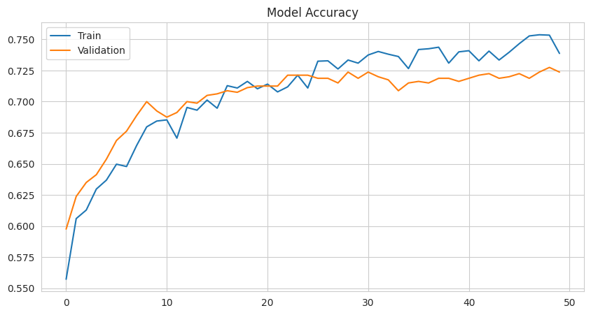
    


    
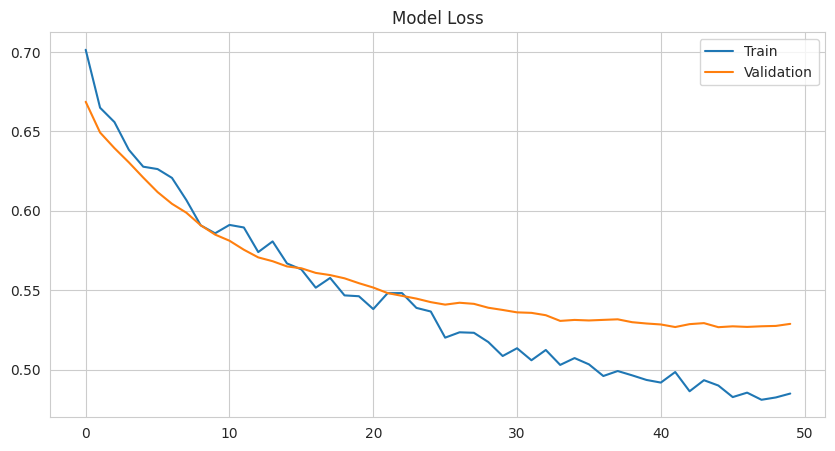
    


```python
import numpy as np
from sklearn.metrics import classification_report, accuracy_score,f1_score,confusion_matrix

test_loss, test_acc = model.evaluate(X_test, y_test)
print("Test Accuracy:", test_acc)

y_pred = np.argmax(model.predict(X_test), axis=1)


print(classification_report(y_test, y_pred))
print("Accuracy:", accuracy_score(y_test, y_pred))
```

    32/32 ━━━━━━━━━━━━━━━━━━━━ 1s 16ms/step - accuracy: 0.7462 - loss: 0.4817
    Test Accuracy: 0.7350000143051147
    32/32 ━━━━━━━━━━━━━━━━━━━━ 0s 8ms/step
                  precision    recall  f1-score   support
    
               0       0.64      0.70      0.67       379
               1       0.81      0.75      0.78       621
    
        accuracy                           0.73      1000
       macro avg       0.72      0.73      0.72      1000
    weighted avg       0.74      0.73      0.74      1000
    
    Accuracy: 0.735

